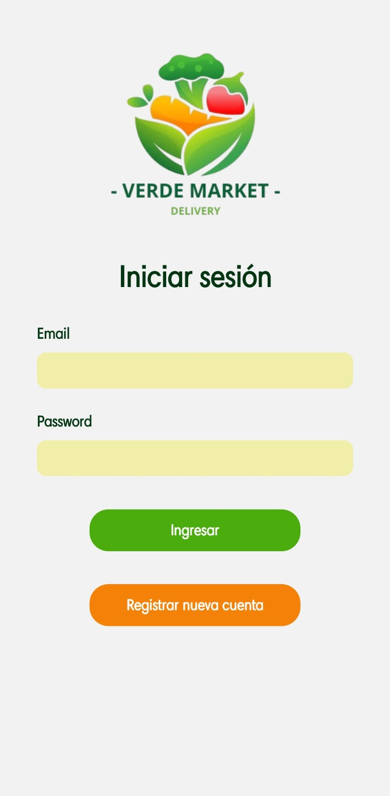

# E-Commerce App - VerdeMarket

Se desarrollo un aplicacion mobile con React Native, sobre un ecommerce. El objetivo del mismo fue poder aplicar todos los conocimientos adquiridos en las distintas clases del curso.

La idea de este ecommercedonde esta basada en una fruteria y verduleria online "VerdeMArket". En la misma el usuario podra navegar por las distintas pantanllas de la aplicacion, buscando los productos deseados y realizando la compra final.

Tambien posee un sistema de autenticación de Firebase para gestionar el acceso de usuarios. Permitiendo a estos iniciar sesión y registrarse de manera segura.
En este servicio tambien se van a guardar los carritos y ordenes de cada usuario, identificados cada uno por un id unico.

## Funcionalidades Principales

Las funciones principales de la aplicacion son:

- Permitir el acceso a travez de un logueo,
- Navegar por las distintas categorias y o productos.
- Efectuar una seleccion y compra, que luego nos llevara a generar una orden con los detalles de la compra.
- Tambien cuenta con una pantalla de perfil, donde el usuario podra cambiar su foto de perfil, y fijar una direccion (localizacion).

### Pantalla de Cuenta o Login

- Una pantalla de Logeo donde, solo los usuarios autenticados pueden acceder a la pantalla de perfil y realizar compras.
- Una pantalla de resgistro de nueva cuenta.
- Una pantalla de perfil, donde se muestra los detalles del usuario, como nombre, imagen de perfil y dirección.




### Pantalla Home

- Muestra las categorías en iconos, un buscador y algunos productos random.
- Al hacer clic en una categoría, se navega a la pantalla de productos correspondiente.


### Pantalla de Productos

- Lista todos los productos en tarjetas con nombre, foto y precio.
- Incluye un buscador para filtrar productos por nombre.
- Al hacer clic en un producto, se navega a la pantalla de detalles del producto.


### Pantalla de Detalles del Producto

- Proporciona una descripción detallada del producto.
- Muestra el precio.
- Permite agregar la cantidad del producto.
- Permite agregar el producto al carrito, navegando al carrito.


### Pantalla de Carrito

- Muestra los productos seleccionados a comprar.
- El total de la compra.
- Un boton para finalizar la compra, que luego navega a las ordenes.


### Pantalla de Ordenes

- Muestra las ordenes de las compras finalizadas. Cada orden pose fecha de la compra, una descripcion de productos con precios y total de la misma.


### Navegación Inferior

Se desarrollo un tag de navegacion inferior, lo cual permite un acceso mas directo a las pantallas nombradas a continuacion:

- **Pestaña 1 - Productos:** Home.
- **Pestaña 2 - Carrito:** Detalles del carrito de compras.
- **Pestaña 3 - Órdenes:** Historial de órdenes realizadas.
- **Pestaña 4 - Perfil:** Información del usuario, ubicación y carga de imagen de perfil.

```javascript
const Tab = createBottomTabNavigator();

const TabNavigator = () => {
  return (
    <Tab.Navigator
      screenOptions={{
        headerShown: false,
        tabBarShowLabel: false,
        tabBarStyle: styles.tabBar,
        tabBarLabelPosition: "beside-icon",
      }}
    >
      <Tab.Screen
        name="ShopStack"
        component={ShopStack}
        options={{
          tabBarIcon: ({ focused }) => (
            <TabBarIcon focused={focused} text="Home" icon="home" />
          ),
        }}
      />
      <Tab.Screen
        name="CartStack"
        component={CartStack}
        options={{
          tabBarIcon: ({ focused }) => (
            <TabBarIcon focused={focused} icon="shopping-cart" text="Carrito" />
          ),
        }}
      />
      <Tab.Screen
        name="OrderStack"
        component={OrderStack}
        options={{
          tabBarIcon: ({ focused }) => (
            <TabBarIcon focused={focused} text="Ordenes" icon="list" />
          ),
        }}
      />
      <Tab.Screen
        name="ProfileStack"
        component={ProfileStack}
        options={{
          tabBarIcon: ({ focused }) => (
            <TabBarIcon focused={focused} text="Perfil" icon="user" />
          ),
        }}
      />
    </Tab.Navigator>
  );
};

export default TabNavigator;
```

## Tecnologías Utilizadas

- **Firebase Authentication:** Implementa el sistema de autenticación de Firebase para gestionar la seguridad de la aplicación.
- **React Native Navigation Stack:** Gestiona la navegación entre pantallas.
- **React Native Navigation Buttom tap:** Gestiona la navegación entre pestañas.
- **Expo-Location:** Permite acceder y gestionar la ubicación del usuario.
- **Expo-Picker-Image:** Facilita la carga de imágenes de perfil.
- **Redux:** Centraliza y gestiona el estado de la aplicación.
- **RTK Query y Firebase:** Realiza operaciones de lectura/escritura en la base de datos.

## Instalación

1. Clona el repositorio: `git clone https://github.com/jonalippo/ProyectoVerderMarket.git`
2. Instala las dependencias: `npm install`
3. Configura las claves de API para servicios externos (Expo-Location, Firebase, etc.).
4. Configura las credenciales de Firebase en tu proyecto.
5. Ejecuta la aplicación: `npm start`

## Contacto

Para preguntas o soporte, contacta a jonalippo@gmail.com
